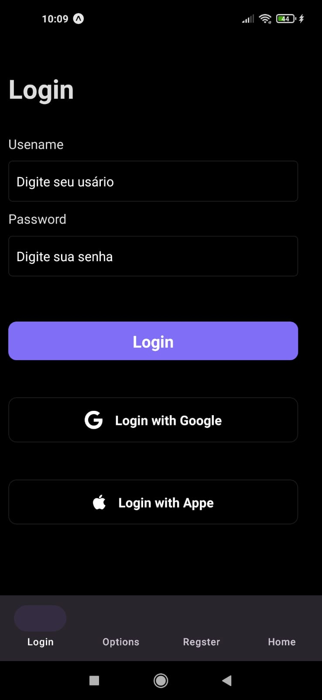
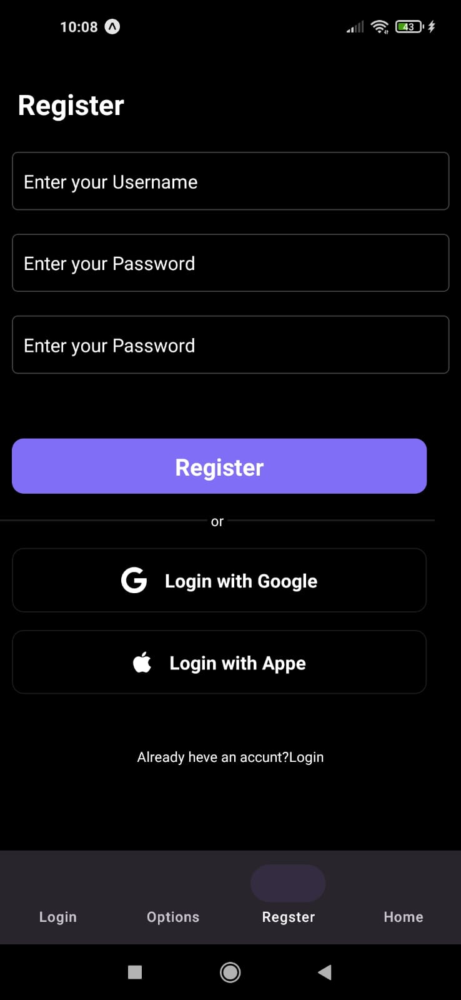
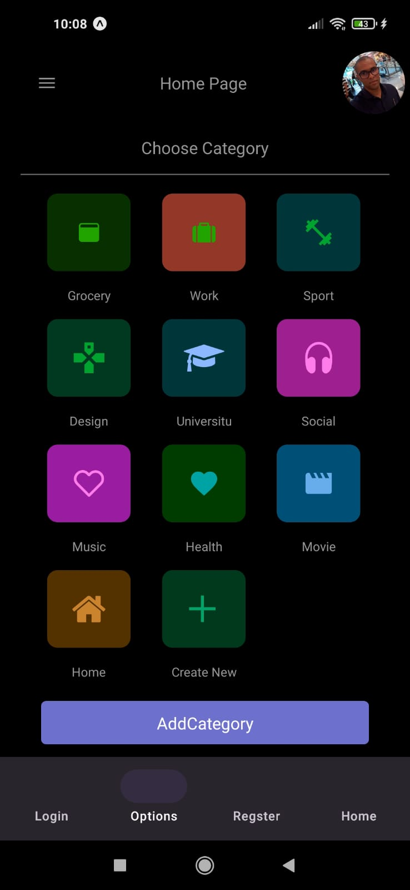

# Projeto Todo List
 Aplicativo visa ajudar ao gerenciamento de tarefas diárias de forma simples

## Tecnologias Utilizadas

- <a href="#" >React Native</a>
- <a href="#" >Typescript</a>
- <a href="#" >Style Components</a>

## Funcionalidades
 - Registro de usuário
 - Login com senha ou conta Google
 - Adicionar tarefas
 - Marca tarefas concluídas 

## Layout
